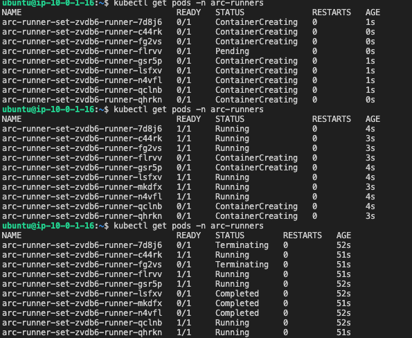
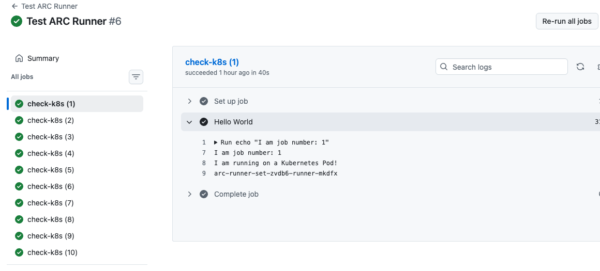

# GitHub Actions Self-Hosted Runner with ARC on K8s

This repository demonstrates the setup and deployment of **Actions Runner Controller (ARC)** on a Kubernetes cluster hosted on **AWS EC2**. It uses the modern **Autoscaling Runner Scale Sets** architecture to provide ephemeral, scalable runners for GitHub Actions.

## 🏗️ Architecture
- **Infrastructure:** EKS/AWS or standalone cluster with controlplane & workernode
- **Orchestration:** Kubernetes (K8s)
- **Controller:** Actions Runner Controller (ARC)
- **Scaling:** Runner Scale Sets (Autoscaling based on job demand)

## 🚀 Setup & Installation

### 1. Prerequisites
- A working Kubernetes cluster.
- Helm installed on the master node.
- A GitHub Personal Access Token (PAT) with `repo` scopes.

### 2. Environment Variables
export GITHUB_PAT="your_ghp_token"
export githubConfigUrl="[https://github.com/Mahesh3602/github-actions-self-hosted-runner-arc](https://github.com/Mahesh3602/github-actions-self-hosted-runner-arc)"

### 3. Install ARC Controller
helm repo add actions-runner-controller https://actions-runner-controller.github.io/actions-runner-controller

kubectl create namespace arc-systems

helm install arc-controller \
    oci://ghcr.io/actions/actions-runner-controller-charts/gha-runner-scale-set-controller \
    --namespace arc-systems

### 4. Install Runner Scale Set
helm install arc-runner-set \
    --namespace arc-runners \
    --create-namespace \
    --set githubConfigUrl="${githubConfigUrl}" \
    --set githubConfigSecret.github_token="${GITHUB_PAT}" \
    oci://ghcr.io/actions/actions-runner-controller-charts/gha-runner-scale-set

### 5 . verify- pods created and destroy during the job run

